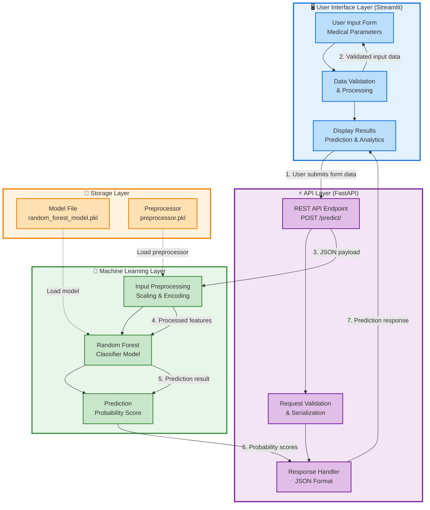
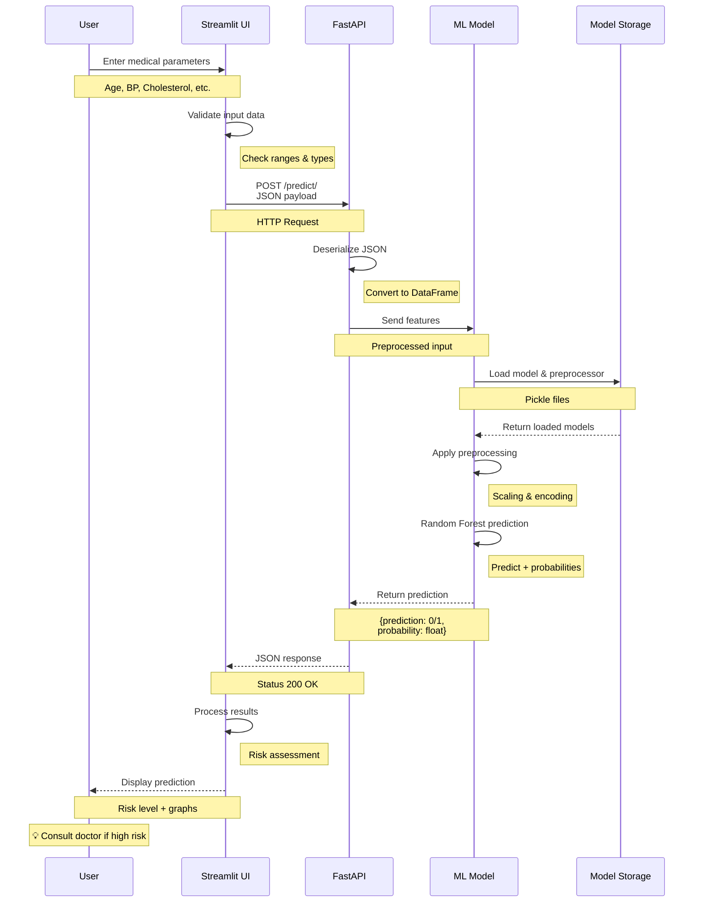
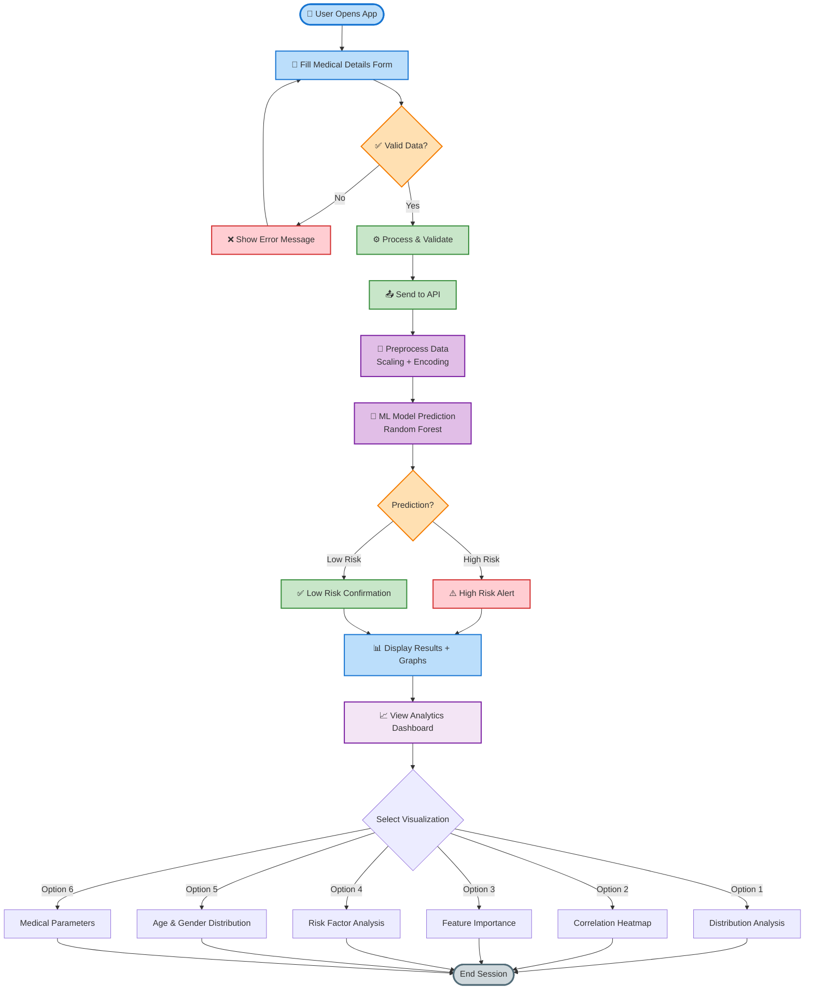

# Heart Disease Prediction - Data Flow Diagram

## System Architecture Overview

## Detailed Request-Response Flow

## Component Interaction Diagram

```mermaid
graph LR
    subgraph Frontend["Frontend Components"]
        A[Input Form] --> B[Validation Logic]
        B --> C[API Client]
        C --> D[Result Display]
        D --> E[Analytics Dashboard]
    end
    
    subgraph Backend["Backend Services"]
        F[API Router] --> G[Request Handler]
        G --> H[Data Processor]
        H --> I[Prediction Service]
    end
    
    subgraph Models["ML Infrastructure"]
        J[Feature Preprocessor]
        K[Random Forest Model]
        L[Prediction Pipeline]
    end
    
    E -.->|Triggers prediction| F
    I -->|Uses| J
    I -->|Loads| K
    J -->|Feeds into| K
    K -->|Generates| L
    L -->|Returns| I
    I -->|Sends result| G
    G -->|Response| F
    F -->|JSON data| C
    
    style Frontend fill:#e3f2fd,stroke:#1976d2,stroke-width:3px
    style Backend fill:#f3e5f5,stroke:#7b1fa2,stroke-width:3px
    style Models fill:#e8f5e9,stroke:#388e3c,stroke-width:3px
```

## Data Transformation Pipeline

```mermaid
flowchart LR
    A[Raw User Input<br/>JSON Object] --> B[Data Parsing<br/>Dictionary]
    B --> C[DataFrame Creation<br/>Pandas DataFrame]
    C --> D[Feature Scaling<br/>StandardScaler]
    D --> E[Categorical Encoding<br/>OneHotEncoder]
    E --> F[Final Feature Vector<br/>Numeric Array]
    F --> G[Model Inference<br/>Random Forest]
    G --> H[Prediction Output<br/>Binary Class 0/1]
    H --> I[Probability Scores<br/>Confidence %]
    I --> J[Result Formatting<br/>JSON Response]
    
    style A fill:#bbdefb,stroke:#1976d2,stroke-width:2px
    style B fill:#bbdefb,stroke:#1976d2,stroke-width:2px
    style C fill:#bbdefb,stroke:#1976d2,stroke-width:2px
    style D fill:#c8e6c9,stroke:#388e3c,stroke-width:2px
    style E fill:#c8e6c9,stroke:#388e3c,stroke-width:2px
    style F fill:#c8e6c9,stroke:#388e3c,stroke-width:2px
    style G fill:#e1bee7,stroke:#7b1fa2,stroke-width:2px
    style H fill:#e1bee7,stroke:#7b1fa2,stroke-width:2px
    style I fill:#ffe0b2,stroke:#f57c00,stroke-width:2px
    style J fill:#bbdefb,stroke:#1976d2,stroke-width:2px
```

## Complete System Flow with Analytics

---

## Usage Instructions

### For Presentations:

1. **Copy any diagram** and paste it in:
   - GitHub README.md
   - Notion documents
   - Markdown editors with Mermaid support
   - VS Code with Mermaid extension

2. **Render online** at:
   - [Mermaid Live Editor](https://mermaid.live/)
   - [GitLab/GitHub](native support)

3. **Export as image**:
   - Use Mermaid CLI: `mmdc -i diagram.mmd -o diagram.png`
   - Screenshot from live editor
   - Browser DevTools → Capture node screenshot

### Color Scheme:
- 🔵 **Light Blue** (#e3f2fd, #bbdefb) - User Interface
- 🟣 **Light Purple** (#f3e5f5, #e1bee7) - API Layer
- 🟢 **Light Green** (#e8f5e9, #c8e6c9) - ML Layer
- 🟠 **Light Orange** (#fff3e0, #ffe0b2) - Storage

### Perfect for College Presentation! 🎓
